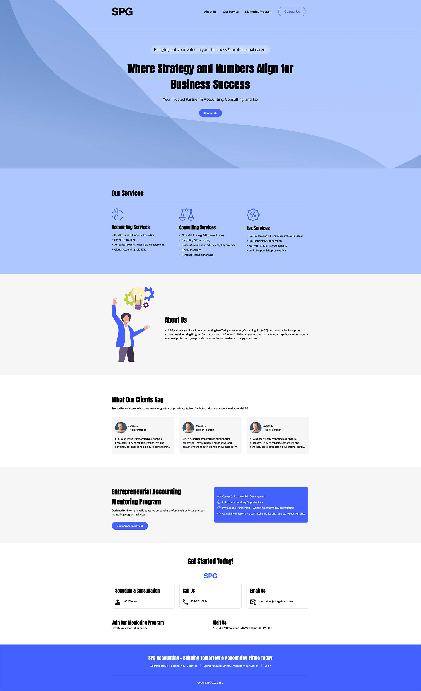

# SPG Landing Page

A modern, responsive landing page for SPG Accounting, designed to showcase accounting, consulting, and tax services, as well as an exclusive mentoring program for accounting professionals and students.

## Overview
SPG Landing Page is a static website built with HTML and CSS. It highlights SPG's core services, client testimonials, and a mentoring program for aspiring and internationally educated accounting professionals. The design is clean, professional, and mobile-friendly.



## Features
- **Responsive Design:** Looks great on all devices.
- **Service Sections:** Accounting, Consulting, and Tax services detailed with icons.
- **About Us:** Company mission and approach.
- **Mentoring Program:** Special section for the Entrepreneurial Accounting Mentoring Program.
- **Testimonials:** Client feedback to build trust.
- **Contact Section:** Easy access to consultation, phone, email, and location.
- **Custom Fonts:** Uses Anton and Lato for a modern look.

## Folder Structure
```
spg-landing-page/
  ├── fonts/         # Custom web fonts (Anton, Lato)
  ├── images/        # SVGs, logos, and photos used in the site
  ├── index.html     # Main HTML file
  ├── styles.css     # Main CSS stylesheet
  └── README.md      # Project documentation
```


## Customization
- **Colors & Fonts:** Adjust CSS variables and `@font-face` rules in `styles.css`.
- **Sections:** Add, remove, or modify sections in `index.html` to fit your needs.
- **Branding:** Replace logos and icons in the `images/` folder.


---

© 2025 SPG Accounting – Building Tomorrow's Accounting Firms Today
